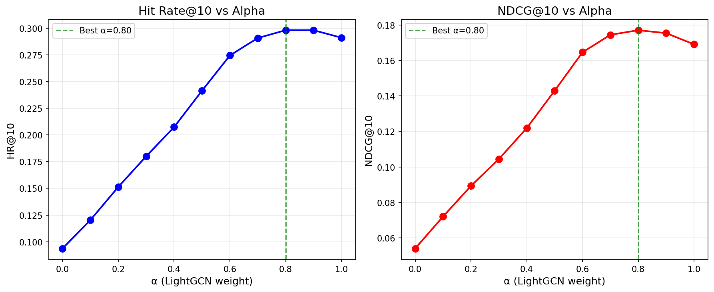

# Hybrid LightGCN + TF-IDF Recommender

**Paper Reference**: Combines LightGCN (SIGIR 2020) with TF-IDF Content-Based Filtering

---

## 🚀 Quick Start

```bash
cd Hybrid_LightGCN_TFIDF

# Demo
python demo.py

# Alpha Tuning
python tune_alpha.py --sample-users 3000

# Evaluation
python evaluate.py --sample-users 5000 --alpha 0.8
```

---

## 🔬 Method

### Weighted Score Fusion

```
hybrid_score = α × CF_score + (1-α) × CB_score
```

Where:
- **CF_score**: LightGCN collaborative filtering score
- **CB_score**: TF-IDF content-based similarity score
- **α**: Fusion weight (**optimal: 0.80**)

### Score Normalization

Both CF and CB scores are min-max normalized to [0, 1] before fusion:

```python
normalized = (score - min) / (max - min)
```

---

## 📊 Alpha Tuning Results

Evaluated on 3,000 users with leave-one-out protocol:

| Alpha | HR@10 | NDCG@10 | Description |
|-------|-------|---------|-------------|
| 0.00 | 9.37% | 5.41% | TF-IDF only |
| 0.10 | 12.03% | 7.21% | |
| 0.20 | 15.13% | 8.93% | |
| 0.30 | 18.00% | 10.44% | |
| 0.40 | 20.73% | 12.19% | |
| 0.50 | 24.13% | 14.29% | |
| 0.60 | 27.43% | 16.46% | |
| 0.70 | 29.07% | 17.44% | |
| **0.80** | **29.80%** | **17.70%** | ⭐ **Best** |
| 0.90 | 29.80% | 17.54% | |
| 1.00 | 29.10% | 16.91% | LightGCN only |

### Key Findings

- 🏆 **Best α = 0.80** (80% LightGCN + 20% TF-IDF)
- 📈 **+2.41%** improvement over LightGCN only
- 📈 **+218.15%** improvement over TF-IDF only
- Hybrid consistently outperforms pure CF or CB methods



---

## 📁 Files

| File | Description |
|------|-------------|
| `config.py` | Configuration (paths, weights, settings) |
| `model.py` | HybridRecommender class |
| `demo.py` | Interactive demo |
| `evaluate.py` | Evaluation metrics |
| `tune_alpha.py` | Alpha grid search |

---

## 🔧 Usage

### Python API

```python
from model import load_hybrid_recommender

# Load hybrid recommender with optimal alpha
hybrid = load_hybrid_recommender(alpha=0.8)

# Get recommendations for a user
user_idx = 123
user_history = hybrid.lightgcn_data.user_pos_items[user_idx]
recommendations = hybrid.recommend_with_details(user_idx, user_history, top_k=10)

# Change alpha dynamically
hybrid.set_alpha(0.7)  # Adjust if needed
```

### Demo

```python
from demo import DemoRecommender

demo = DemoRecommender(alpha=0.8)
demo.recommend_user(12345)           # Get recommendations
demo.compare_methods(12345)          # Compare LightGCN vs TF-IDF vs Hybrid
demo.random_demo()                   # Random user demo
```

### Alpha Tuning

```bash
# Standard grid search (step=0.1)
python tune_alpha.py --sample-users 3000

# Fine-grained search (step=0.05)
python tune_alpha.py --sample-users 3000 --fine

# Custom range
python tune_alpha.py --alpha-min 0.6 --alpha-max 0.9 --alpha-step 0.05
```

---

## 📖 References

1. **LightGCN**: He et al., "LightGCN: Simplifying and Powering Graph Convolution Network for Recommendation", SIGIR 2020
   - https://arxiv.org/abs/2002.02126

2. **TF-IDF**: Salton & McGill, "Introduction to Modern Information Retrieval", 1983

3. **Hybrid Systems**: Burke, "Hybrid Recommender Systems: Survey and Experiments", 2002
